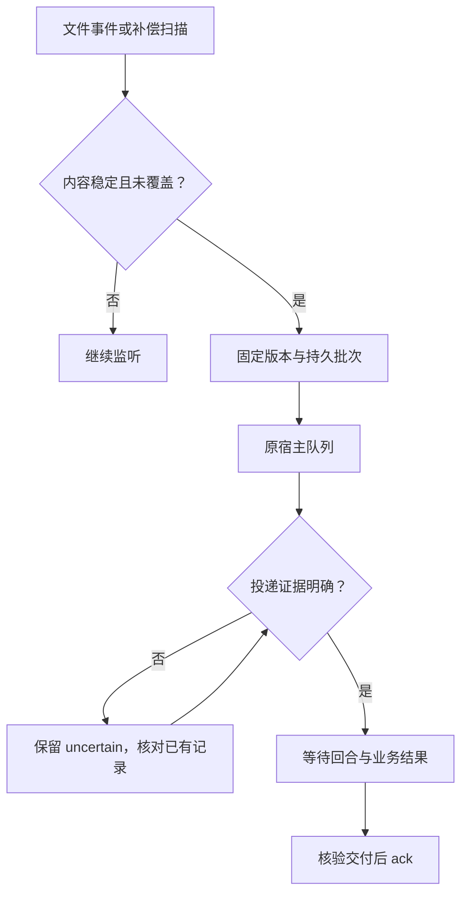

# Codex Condition Trigger

**Use file conditions to decide when an existing Codex thread should receive work.**

一个实验性的文件条件触发器：普通程序负责监听、稳定判断和去重，只有出现新内容时才准备 Codex 任务。

**状态：实验候选，PR 保持 Draft；单次 IPC、短时监督自动监听及准确原聊天开窗/最小化试验均获 Alice 限定接受。** 2026-10-06完成一次真实原聊天合成验证：同一持久批次只投递一次，原聊天实际读文件/核对哈希，返回137+209=346；回合完成及设置继承已核对，调用者验证后登记合成ACK。同回合Hook提示可达；持续运行、业务处理和未来版本仍未验收。详见 [真实小试报告](docs/KELAN_IPC_CANARY_20261006.md)。本项目不是 OpenAI 官方产品。


2026-10-08 新增一次短时监督自动监听试验：一个合成文件由真实 Windows watcher 自动投递，无手动 dispatch；实际工具、173+284=457、设置继承和合成回执核验通过，由外层监督器在约 101 秒后通知正常停止。Alice 已复审最终证据并限定接受，见[复审与原聊天加载方向](docs/ALICE_SUPERVISED_WATCH_REVIEW_20261008.md)。重启后需先在原生界面打开目标聊天，未验收无人值守加载或正式业务运行。见[监督试验报告](docs/KELAN_SUPERVISED_WATCH_TRIAL_20261008.md)。


2026-10-08 早期默认关闭的加载准备、准确菜单开窗与最小化试验已获 Alice 限定接受，见[历史报告](docs/KELAN_OWNER_LOADER_20261008.md)。当前后续实现已用逐批 WindowCycles 替代原永久一次 prepare_owner 接口，接入 watcher，并提供一个监督限定的 Windows 后端。

红魔要求的逐批循环已完成候选实现和两个连续合成批次的监督试验：1次新开/最小化/正常关闭，2次原生发送、0次手动dispatch，关闭后owner仍在而直接复用。Alice 已限定接受这次监督路径，但源码复审发现一个必修恢复缺口：未发送批次已记为 reused 后，owner 消失会持续等待，不能进入首次开窗。云端既有 39 项定点检查通过，补充反例失败；当前 changes_requested，见[复审与修订范围](docs/ALICE_WINDOW_CYCLE_REVIEW_20261008.md)及[本地报告](docs/KELAN_WINDOW_CYCLE_20261008.md)。当前 ACK 仍由调用者核验；任意导航后的准确当前聊天识别和无人值守关闭尚未解决，整体默认关闭、Draft。

## 用途

适合“材料到达才值得让模型工作”的场景，例如：

- 一个 agent 投送新报告，另一个 Codex 会话开始审查。
- 实验或构建结果写入目录，稳定后交给已有项目会话分析。
- 文档内容发生实际变化后触发增量处理，跳过仅修改时间戳或重复复制。

本版只实现**文件内容条件**，不包含通用规则语言、Webhook、GUI 或后台自启。机器上需要运行监听进程。

## 工作原理

1. watchdog 接收系统文件事件；启动时和周期性本地扫描用于补偿漏事件。
2. 两次内容快照保持一致并满足稳定时间后，用 SHA-256 判定是否出现新内容。
3. 保存固定版本和批次清单，在 SQLite 中登记待投递状态。
4. 通过已明确选择的聊天适配器投递：JSONL 后端向准确 thread 入队，实验 IPC 后端只在可证明空闲时发起准确原聊天回合。
5. 分开记录入队、回合状态和业务交付回执；不能确认发送结果时保留待核对状态。

无新内容、无待投递批次时，不连接 Codex、不产生模型回合。补偿扫描和待投递状态核对由本地程序执行。它们仍会使用少量本机资源。



## 快速试用：只观察文件

需要 Python 3.10+。默认模式不会启动 Codex 或连接模型。

Windows PowerShell：

```powershell
py -m venv .venv
.\.venv\Scripts\python.exe -m pip install -r requirements.txt
Copy-Item .\example.windows.json .\local-test.json
New-Item -ItemType Directory -Force D:\trigger-demo\inbox
.\.venv\Scripts\python.exe .\trigger.py --config .\local-test.json run
```

Linux：

```bash
python3 -m venv .venv
.venv/bin/python -m pip install -r requirements.txt
cp example.linux.json local-test.json
mkdir -p /tmp/codex-trigger-demo/inbox
.venv/bin/python trigger.py --config local-test.json run
```

修改配置中的目录，使输入、项目和状态位置符合你的环境。所有配置路径必须是绝对路径，输入树与状态树不能互相嵌套。示例 thread UUID 全为零，是占位符；dry mode 不使用真实聊天。

默认稳定窗口为 120 秒；演示时可在 `local-test.json` 中改成 2 秒。放入一个文本文件后应出现 `batch_ready`。重复复制相同字节或仅 touch 不再生成批次。

在另一个终端停止并查看状态（Windows 使用相应的 `.venv\Scripts\python.exe`）：

```bash
.venv/bin/python trigger.py --config local-test.json stop
.venv/bin/python trigger.py --config local-test.json status
```

`unpause` 清除持久暂停标记，之后重新运行 `run`。Ctrl+C 只结束当前 watcher。已经投递到 Codex 的工作不受本地 `stop` 自动撤销。

## 接入真实 Codex 前要知道的事

**入队成功不等于原聊天已被唤醒。** 在本项目核对的官方源码版本中，`queue` 对未加载线程只保存输入；已有 Desktop 会话与另起的 app-server 也不能仅凭相同 UUID 视作相同运行环境。

所以配置默认保留：

```json
{
  "transport_command": [],
  "owner_verified": false,
  "resume_unloaded": false
}
```

`transport_command` 是连接**已有实际宿主**的 JSONL 代理 argv，不是新开 `codex app-server` 的启动命令。本项目目前没有提供经过真实 Windows Desktop 验证的通用连接命令。

JSONL 说明见 [本机接入与回执](docs/INTEGRATION.md)，实验 Windows 后端见 [IPC 适配器与限制](docs/IPC_ADAPTER.md)。`owner_verified` 是本机操作者完成验证后的登记；程序不能替代这项验证。适配器不发送模型、工作目录或审批/沙箱权限覆盖字段，也不会代替 Desktop 工具或批准权限请求。

## 主要参考思路

| 来源 | 在本项目中的作用 |
| --- | --- |
| [OpenAI Codex](https://github.com/openai/codex) 的 queue 客户端、服务端和协议 | 直接核对请求字段、线程加载语义、队列回执和客户端消息 ID |
| [Codex Triggers](https://github.com/ank1015/codex-triggers) | 参考“事件检测 → 持久通知 → 独立投递”的分层思路，以及不同 Codex 适配器的取舍 |
| [watchdog](https://pypi.org/project/watchdog/6.0.0/) | 实际运行依赖；使用其系统文件监听能力 |
| [chokidar-cdx](https://github.com/codexophile/chokidar-cdx)、[gnosis-container](https://github.com/DeepBlueDynamics/gnosis-container) | 调研比较对象，用于判断通用文件触发器和容器任务方案是否适合原会话需求 |

本项目独立编写，没有复制上述候选应用的源码。新增 IPC 协议参考与许可列在 [第三方说明](THIRD_PARTY_NOTICES.md)。watchdog 通过 requirements 安装，没有随仓库打包。更详细的取舍、固定源码链接和证据范围见 [设计与来源](docs/DESIGN_AND_REFERENCES.md) 和 [SOURCES.json](SOURCES.json)。

## 已实现与边界

| 已实现 | 仍需注意 |
| --- | --- |
| 稳定窗口、字节去重、固定版本保存、可选 READY 标记门控 | 完整包仍依赖投送方在写入前移除旧标记、写完后再创建标记 |
| SQLite 批次、启动补偿、单 worker 锁 | 没有自动清理历史 blob 的保留策略 |
| ZIP CRC 和体积限制 | ZIP 与展开材料没有语义去重 |
| 投递前连接失败退避重试 | 接受结果不明时不盲目重发，不保证 exactly-once |
| 精确 UUID 的 JSONL 队列；独立 IPC 后端忙碌时保留本地批次 | 已通过一次真实原聊天合成小试；持续运行、业务交付、并发及未来版本仍未验收 |
| 交付证据 ack，允许与 watcher 并行；delivered 及原证据受原子更新条件保护 | ack 是调用者的核验声明；本包不访问 Drive 等交付服务 |
| 一个未交付批次阻止后续投递 | 业务失败续接仍需现有工作流处理，不能无人值守无限推进 |

## 测试

### 实验窗口循环（默认关闭）

Windows Desktop IPC 的 `run --live` / `dispatch` 已接入逐批准备和交付后清理。空闲 owner 复用、忙碌等待、明确缺失才开窗；下一批须等上一轮清理确认。旧 `owner_load_attempt:*` claim 保留待人工对账，不自动迁移或删除。`status` 的批次 delivered 只代表调用者 ACK，窗口阶段另保存在 `meta` 的 `window_cycle:<batch_id>`。

`owner_loading_enabled` 默认 false。配置 `window_backend_command` 为无 shell 展开的 argv；`windows_window_backend.ps1` 需要 Windows UI Automation、明确主 HWND、当前安装可执行文件路径、准确目标标题和菜单名。其 JSON 参数格式及试验边界见 [窗口循环报告](docs/KELAN_WINDOW_CYCLE_20261008.md)。不要把示例零 UUID 或任意标题当成准确归属。

**当前 Windows 后端只支持有截止时间的人工监督、不导航试用。** UIA initialRoute 是创建时路由，当前标题不能排除同名导航；因此后端要求操作者明确登记最长 600 秒的 `supervised_no_navigation_until`，并在每个副作用前检查截止时间与 STOP。这项登记不检测或强制用户不导航，也不构成无人值守的当前聊天身份验证。过期或结果不明保留清理状态，不重开、不重发。真实业务仍由调用者核验并 ACK；关联 turn 尚未对账时先拒绝循环 ACK。未合并、安装或恢复正式调度。

后端返回的 lease 包含真实 HWND、进程启动信息和独有窗口属性 token，不能用 Computer Use 的 opaque ID 替代。仅关闭本次创建并在监督范围内复核的专窗；旧窗口和复用 owner 的用户窗口不获得关闭权。正常关闭使用 WM_CLOSE，不退出主应用。

```bash
python -m unittest discover -s tests -v
```

公开版本在 Linux / Python 3.12.14 / watchdog 6.0.0 下的复跑结果见 [test-results.txt](evidence/test-results.txt)。测试包括真实 inotify、停机期间新增文件的启动恢复，以及明确使用替身的协议/回执故障情景。模拟宿主测试不构成真实 Codex Desktop 接入证明。

2026-10-03 静态复核后的修订通过 44 项测试（原有 33 项方法及新增 11 项）。并行 ACK、响应 deadline 和历史文本误关联的旧版失败证据、修复说明及旧状态库兼容边界见 [复核修订记录](docs/REVIEW_FIXES_20261003.md)。

项目现状与下一步见 [CURRENT_STATE.md](CURRENT_STATE.md)，增量记录见 [WORK_LOG.md](WORK_LOG.md)。
